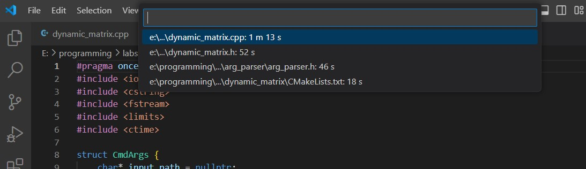
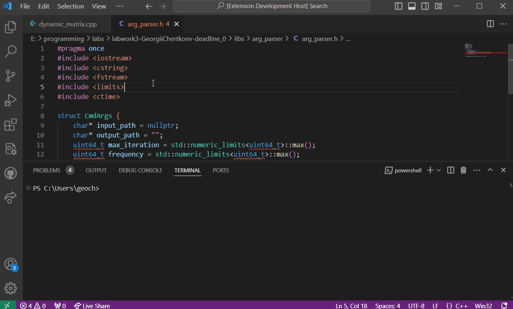

# code-timer README

This extension can count time each file was open

## Features
Time will start counting when you *open* file

Via command "Show Time Files Were Open" you can see time each file was open

Alo you can delete one file time via "Clear one file time" or all files time with "Clear all written time"

## Requirements

vscode version >= 1.91.1

**Enjoy!**
